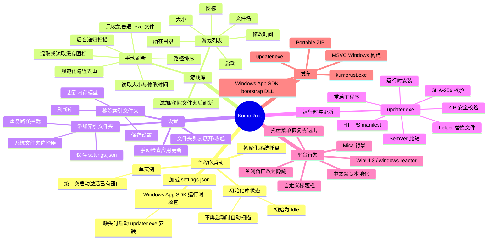
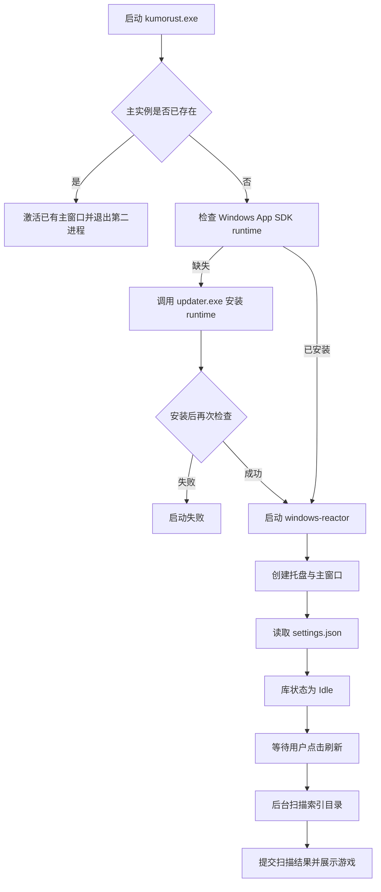
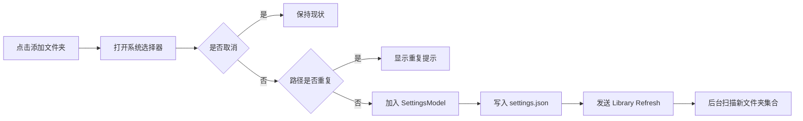

# KumoRust 功能与行为地图

这份文档是 KumoRust 的“不要遗忘清单”。它记录产品功能、启动副作用、后台任务、持久化、网络行为和当前已知限制。新增功能时，应同时更新这里的功能入口、状态变化、外部副作用和验证项。

## 1. 产品定位

KumoRust 是一个 Windows 桌面游戏库启动器：用户指定一个或多个游戏目录，应用递归寻找 `.exe`，展示图标和文件信息，并从游戏所在目录启动可执行文件。

它不是游戏元数据服务，也没有远程游戏目录或账号系统。当前游戏库是运行时扫描结果，不会把游戏列表持久化到设置文件。

## 2. 一张图看全系统



## 3. 主流程

### 3.1 正常启动



关键契约：

- 启动时会加载索引文件夹，但不会自动扫描文件夹。
- 库页的 `Refresh` 是手动扫描入口。
- 新增或移除索引文件夹仍然会保存配置并触发一次扫描，这是配置变化后的同步行为，不是应用启动扫描。
- Windows App SDK runtime 检查仍然发生在主程序启动阶段；它用于保证 WinUI 运行环境可用，与游戏库扫描无关。

### 3.2 添加文件夹



### 3.3 手动刷新

`LibraryMessage::Refresh` 会：

1. 将 `scan_generation` 加一。
2. 将状态设为 `Scanning { inspected: 0, found: 0 }`。
3. 由根组件把当前设置文件夹复制到后台任务。
4. 扫描完成后发送 `ScanFinished`。
5. 只接受当前 generation 的结果，旧任务结果会被丢弃。

旧任务不会因为新一轮刷新而真正取消：后台任务收到的 cancellation token 当前没有被扫描逻辑使用。generation 机制保证旧结果不覆盖新结果，但大量重复刷新仍可能产生并行 I/O。

## 4. 功能清单

### 4.1 游戏库页

可见功能：

- 展示库标题、游戏数量和扫描状态。
- 点击刷新，重新扫描所有索引文件夹。
- 点击添加文件夹，跳转到系统文件夹选择器流程。
- 空库时引导去设置页添加文件夹。
- 展示每个游戏的图标、文件名、类型、所在目录、文件大小、修改时间。
- 点击启动按钮运行游戏。
- 列表支持选择项，选择状态只存在内存中。

扫描规则：

- 对每个有效索引文件夹递归遍历。
- 只接受普通文件且扩展名大小写不敏感地等于 `.exe`。
- 不可访问的目录、目录项、metadata 或图标会被跳过或降级，不会形成用户可见的扫描错误列表。
- 用 canonical path 和不区分大小写的字符串去重，因此多个索引目录重叠时通常只展示一次。
- 最终按路径的小写形式排序，结果顺序稳定。
- 游戏名取文件 stem；取不到时使用“未知游戏”。
- 启动时把工作目录设为该 `.exe` 的父目录，并通过 `Command::spawn` 创建独立进程。

不太可见的行为：

- 扫描结果不写入磁盘；程序重启后列表从空状态重新开始。
- 应用当前把进度回调设为 no-op，因此 UI 只有扫描开始和完成状态，实际扫描过程不会逐步刷新 inspected/found 数字。
- `scan_generation` 只负责防止旧结果覆盖新结果，不负责终止旧扫描。
- 文件夹路径不存在时会静默跳过。

### 4.2 图标提取与缓存

- 首先尝试从 PE/ICO 资源中提取最大图标帧。
- 资源提取失败时，回退到 Win32 `ExtractIconExW` 和 bitmap 转 PNG。
- 缓存目录是 `%LOCALAPPDATA%\KumoRust\icons`；没有 `LOCALAPPDATA` 时回退到系统临时目录下的 `KumoRust`。
- 缓存 key 由文件路径、文件大小、修改时间组成；这些变化会让旧缓存失效。
- PNG 先写入 `.png.part`，再改名为最终缓存文件。
- 图标提取失败时游戏仍会出现在列表中，只显示默认图标。

### 4.3 设置页

- 添加索引文件夹：系统文件夹选择器；重复路径按大小写不敏感且 `/` 与 `\` 等价判断。
- 删除索引文件夹：更新内存列表、保存配置、触发扫描。
- 文件夹列表使用可展开/收起的 expander；展开状态只保存在当前进程内。
- 文件夹重复、设置保存失败和游戏启动失败使用根模型的 transient notice；更新器启动失败保存在 `SettingsModel.update_status`，由更新状态卡展示。
- 设置页有应用更新入口；更新正在启动时会阻止重复触发。

配置文件：

```text
%LOCALAPPDATA%\KumoRust\settings.json
```

当前 JSON 结构的有效字段是：

```json
{
  "library_folders": ["C:\\Games", "D:\\SteamLibrary"]
}
```

读取文件不存在或 JSON 无法解析时，会静默使用默认空设置。保存时会创建 `KumoRust` 目录，并重新去重文件夹。

### 4.4 应用更新

主程序只在用户从设置页点击“检查并更新”时启动 updater。成功启动后主进程退出，由 updater 负责后续工作：

1. 使用 `KUMORUST_UPDATE_SOURCE`，未设置时使用 GitHub Releases 的 latest download 目录。
2. 按当前架构生成 `kumorust-update-win-x86.json`、`win-x64` 或 `win-arm64` manifest URL。
3. 只接受 HTTPS、带 host、无用户名和密码的 URL。
4. 读取 manifest，校验目标架构、SemVer、SHA-256 和相对更新包 URL。
5. 远端版本不高于当前版本时不更新，并重新启动主程序。
6. 下载 ZIP 到 `%LOCALAPPDATA%\KumoRust\updates\...`，校验大小和 SHA-256；下载失败会清理 `.part` 文件。
7. 解压时拒绝 symbolic link 和不安全路径，要求包含三个文件：
   - `kumorust.exe`
   - `updater.exe`
   - `microsoft.windowsappruntime.bootstrap.dll`
8. 复制 updater 为临时 helper，等待旧主进程退出。
9. 将新文件暂存、备份旧文件、替换目标文件；失败时尝试回滚。
10. 启动新主程序，清理更新包目录，并安排删除 helper 自身。

直接双击 `updater.exe` 不会执行更新，会被视为无内部参数并忽略。updater 自己也有单实例保护。

### 4.5 Windows App SDK runtime 引导

这条路径与应用版本更新分开：

- 主程序每次成为第一个实例后检查 Windows App SDK `2.4.0` 最低版本，以及同一主版本 `2.x` 的兼容性。
- 启动门槛只检查 `windows-reactor` 实际 bootstrap 使用的 Framework package family、发布者、架构和最低版本；不因 Main、Singleton 或版本化 DDLM 的注册差异误判 runtime 缺失。
- Windows App SDK `3.x` 不满足当前应用的 runtime 要求。
- 缺失时通过同目录的 updater 下载固定 Microsoft Learn `aka.ms` 安装器。
- 安装器下载到 runtime 缓存目录，使用内置 SHA-256 校验；有效缓存可复用。
- 以 quiet 模式安装，退出码 `3010` 视为可接受的重启提示。
- 安装结束后再次查询 package，仍缺失则主程序启动失败。

## 5. 平台与窗口行为

- 主程序通过 `single-instance` 保证 `KumoRust.main` 只有一个实例。
- 第二次启动不会打开第二个窗口，而是查找主窗口并恢复、置前。
- 主窗口使用 WinUI 3 / `windows-reactor`，Mica backdrop，最小尺寸为 800x600。
- 自定义标题栏包含导航 pane 的开关。
- 关闭按钮被 Win32 subclass 拦截，行为是隐藏窗口，不是退出进程。
- 托盘图标提供“启动主界面”和“退出”菜单；退出菜单才会结束进程。
- 托盘菜单会尝试通过动态加载 `uxtheme.dll` 使用深色系统菜单主题。
- 托盘初始化失败不会阻止主窗口继续工作，因为状态用 `Option<TrayState>` 保存。

## 6. 架构地图

```text
main.rs
  -> 单实例
  -> services::updater::ensure_runtime
  -> windows_reactor::App::run_component<KumoApp>

app.rs
  -> AppModel / AppMessage / AppEffect
  -> library reducer + settings reducer
  -> perform: 唯一的 OS、文件、进程、后台任务副作用边界

features/library
  -> model: games, scan status, generation, selection
  -> update: Refresh / ScanFinished / Launch / Select
  -> view + game_card

features/settings
  -> model: folders, update status, expander state
  -> update: Add / Remove / Apply / CheckUpdate / expand
  -> view + folder_card + update_card

domain
  -> folder: GameEntry、路径判重、文件夹去重
  -> update: runtime spec、package identity、版本匹配

services
  -> scanner: 递归文件系统扫描
  -> icon_extractor: Windows 图标转 PNG
  -> updater: runtime 安装和 updater 进程启动

core
  -> config: settings.json 和图标目录
  -> i18n: 中英文 key-value 字符串表
  -> error: 通用 I/O / message error

platform
  -> tray: 原生托盘
  -> window: 激活、隐藏、退出
```

MVU 数据流原则：View 只发 Message；reducer 只改内存模型并返回 Effect；根组件的 `perform` 执行文件系统、对话框、后台任务和进程操作；后台任务完成后再发回 Message。

## 7. 数据、网络和进程边界

| 类别 | 当前行为 |
| --- | --- |
| 本地配置 | 读写 `%LOCALAPPDATA%\KumoRust\settings.json` |
| 本地图标 | 读写 `%LOCALAPPDATA%\KumoRust\icons\*.png` |
| 游戏目录 | 只读递归遍历、读取 metadata、提取图标 |
| 游戏启动 | 以用户权限 spawn `.exe`，工作目录为游戏父目录 |
| runtime 网络 | 固定 HTTPS Microsoft Learn 下载地址，缺 runtime 时触发 |
| 应用更新网络 | 用户点击更新后访问默认 GitHub 地址或 `KUMORUST_UPDATE_SOURCE` |
| 更新写入 | `%LOCALAPPDATA%\KumoRust\updates` 和安装目录中的替换文件/备份 |
| 外部进程 | `updater.exe`、Windows App SDK installer、游戏进程、更新 helper |
| 账户/遥测 | 当前没有账号、登录、遥测或远程游戏元数据 |

## 8. 当前明确的“没有做”

这些不是遗漏，而是当前行为契约：

- 没有启动时自动扫描游戏目录。
- 没有文件系统 watcher、定时扫描或后台常驻同步。
- 没有游戏列表数据库、手动编辑游戏信息、分类、搜索、排序选项或收藏。
- 没有扫描错误明细、权限修复或失效目录管理 UI。
- 没有取消正在运行的扫描；只有旧结果丢弃。
- 没有进度消息的逐步 UI 更新。
- 没有在设置文件中持久化 expander、选择项或上次扫描结果。
- 没有自动更新检查；应用更新必须由用户点击触发。
- 没有运行时语言选择；`Locale::current()` 当前固定返回中文，英文表是预留能力。

## 9. 已知风险与后续优先级

按“容易被忘记且会造成行为误解”的优先级排列：

1. 启动不扫描与“添加/移除后扫描”是两个不同契约，UI、README、测试必须同时表达。
2. 扫描任务没有消费 cancellation token；应考虑真正取消、串行化或 debounce 重复刷新。
3. 扫描过程的 `report` 当前被传入 no-op；若要展示真实进度，需要后台任务发送进度 Message，并处理旧 generation。
4. 扫描和图标失败大多静默；需要决定是保留安静体验还是增加可诊断的错误计数/日志。
5. 保存失败后 SettingsModel 已经改变，但仍可能继续触发 rescan；理想状态是把“持久化成功”纳入状态机，或明确允许临时内存变更。
6. `settings.json` 损坏时直接回到默认空设置，可能让用户误以为数据丢失；应考虑备份、错误提示或恢复策略。
7. 主窗口 native title、标题栏显示文本和窗口激活依赖需要保持一致，否则第二实例激活可能失效。
8. 本地化表存在中英文两套，但托盘菜单仍有直接写死的中文文本，语言切换前要统一入口。

## 10. 以后做需求的防遗忘方法

每个功能需求至少写成下面五个问题的答案：

| 问题 | 要记录的内容 |
| --- | --- |
| 用户入口是什么 | 页面按钮、托盘、启动参数、文件关联、定时器，还是没有 UI 的启动钩子 |
| 状态是什么 | 初始值、进行中、成功、失败、取消、过期结果、重启后的值 |
| 副作用是什么 | 文件读写、网络、子进程、权限、窗口、托盘、后台线程 |
| 触发时机是什么 | 启动、用户动作、配置变化、返回页面、定时、更新重启 |
| 如何证明没有回归 | reducer 单测、边界测试、日志/指标、Windows 手测流程 |

建议把代码按“入口 -> Message -> reducer -> Effect -> 外部副作用 -> 回传 Message”画成小流程图，并在本文件的功能清单和“没有做”中各写一次。尤其不要只在 View 里找功能：`main.rs`、`Component::create`、`use_effect`、托盘回调、`spawn_background`、环境变量和 updater 命令行参数都要纳入检查。

## 11. 本次变更的验收清单

- [x] 第一次打开应用不会调用 `LibraryMessage::Refresh`。
- [x] 有已保存文件夹时，首次库页显示“尚未扫描”，而不是“没有找到游戏”。
- [x] 点击刷新仍会启动后台扫描。
- [x] 添加文件夹仍会保存并扫描。
- [x] 移除文件夹仍会保存并扫描。
- [x] Windows App SDK runtime 检查与 updater 流程不受本次变更影响。
